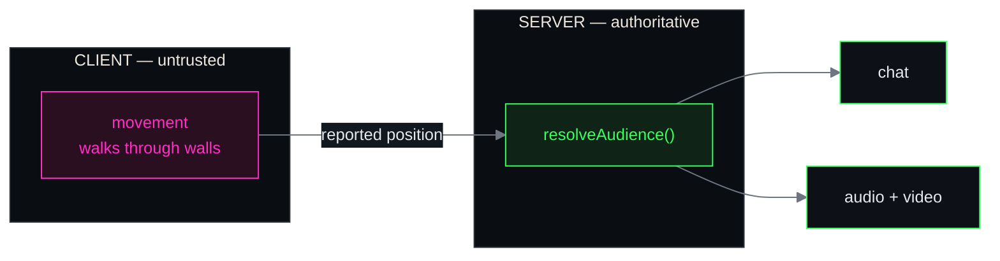
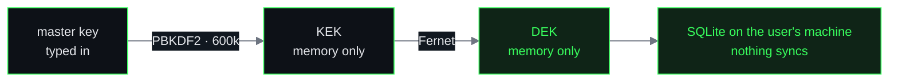
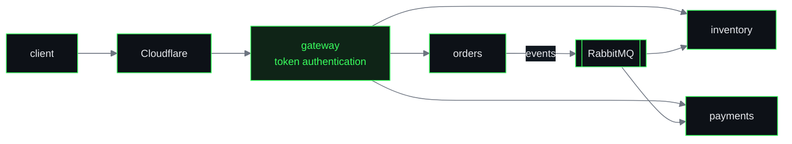

<div align="center">


<a href="https://www.linkedin.com/in/jonathan-ribeiro-da-silva"></a> <a href="https://tryhackme.com/p/J4yz0n"></a> <a href="mailto:jonathanribeirodasilva@outlook.com.br"></a>

<br>


</div>

---

## `01` / About

```console
┌──(jonathan㉿kali)-[~]
└─$ whoami

  User      : j4yz0n
  Hostname  : Jonathan Ribeiro
  Role      : Cyber Security Analyst · Fullstack Developer
  OS        : Kali Linux 2026.1
  Studies   : Technology degree + offensive security tracks
  Goal      : An offensive security team, where reading code
              changes what ends up in the final report
```

I'm passionate about cybersecurity. I build distributed systems by day and study attacks by night,
and each side sharpens the other.

---

## `02` / Tools

No progress bars. Everything here showed up in a lab, in a writeup or in a system I shipped to
production — and I can explain what I did with it.

<h4>Offensive security &nbsp;<code>main focus</code></h4>

The columns are the phases of an engagement. The column a tool sits in tells you when it comes
into play.

<table>
<tr><th align="center" width="20%"><code>01</code><br>Recon</th><th align="center" width="20%"><code>02</code><br>Enumeration</th><th align="center" width="20%"><code>03</code><br>Exploitation</th><th align="center" width="20%"><code>04</code><br>Post-exploitation</th><th align="center" width="20%"><code>05</code><br>Reporting</th></tr>
<tr>
<td align="center" valign="top">

<br><sub>Nmap</sub><br><br>
<br><sub>Wireshark</sub><br><br>
<br><sub>Redes</sub>

</td>
<td align="center" valign="top">

<br><sub>Burp Suite</sub><br><br>
<br><sub>OWASP Top 10</sub><br><br>
<br><sub>Active Directory</sub>

</td>
<td align="center" valign="top">

<br><sub>THC Hydra</sub><br><br>
<br><sub>Segurança Web</sub>

</td>
<td align="center" valign="top">

<br><sub>Hashcat</sub><br><br>
<br><sub>John the Ripper</sub><br><br>
<br><sub>Linux</sub>

</td>
<td align="center" valign="top">

<br><sub>Análise de logs</sub><br><br>
<br><sub>Hardening</sub>

</td>
</tr>
</table>

<p>
   &nbsp; <sub><b>Kali Linux</b> — the platform, spans every phase</sub>
</p>

<h4>Frontend &nbsp;<code>what the user touches</code></h4>
<p>
  &nbsp;&nbsp;
  &nbsp;&nbsp;
  &nbsp;&nbsp;
  &nbsp;&nbsp;
  &nbsp;&nbsp;
  
</p>

<h4>Backend &amp; APIs &nbsp;<code>where the rules live</code></h4>
<p>
  &nbsp;&nbsp;
  &nbsp;&nbsp;
  &nbsp;&nbsp;
  &nbsp;&nbsp;
  &nbsp;&nbsp;
  
</p>

<h4>Data &nbsp;<code>what survives the deploy</code></h4>
<p>
  &nbsp;&nbsp;
  
</p>

<h4>Workflow &nbsp;<code>day to day</code></h4>
<p>
  &nbsp;&nbsp;
  
</p>

<h4>Infrastructure &nbsp;<code>where the app lives</code> &nbsp;·&nbsp; <code>CI/CD</code></h4>
<p>
  &nbsp;&nbsp;
  &nbsp;&nbsp;
  &nbsp;&nbsp;
  &nbsp;&nbsp;
  &nbsp;&nbsp;
  
</p>

---

## `03` / Projects


### [Hubitat](https://github.com/JonathanRibeiroSilva/Hubitat) — self-hosted 3D collaboration platform

<table>
<tr><td><sub><b>Role</b></sub></td><td><sub>Sole author — architecture, server and 3D client</sub></td></tr>
<tr><td><sub><b>Scale</b></sub></td><td><sub>7 containers · one <code>docker compose up</code></sub></td></tr>
<tr><td><sub><b>Stack</b></sub></td><td><sub>TypeScript · NestJS · Three.js · LiveKit · PostgreSQL</sub></td></tr>
<tr><td><sub><b>Security</b></sub></td><td><sub>Client-authoritative movement; audience resolved on the server</sub></td></tr>
<tr><td><sub><b>License</b></sub></td><td><sub>MIT · self-hosted, zero telemetry</sub></td></tr>
</table>

Video calls put everyone in one rectangle and give the floor to one person at a time. Hubitat
replaces that with a **place**: a 3D room your team walks around in, where you hear the people near
you, drift over to a conversation and step away from it — like a physical office. Spatial voice and
video with distance falloff and directional panning, authored zones (private, spotlight, portal), a
built-in map editor, and collaborative objects that outlive the meeting.

The whole thing runs on **your own hardware**. There is no hosted plan, no account on somebody
else's server, and no telemetry.

> [!IMPORTANT]
> **The security decision that defines the project** — movement is client-authoritative, so a
> tampered client walks through walls. What it **cannot** do is escape the server: interest, zone
> occupancy and audience resolution are all computed server-side from the reported position. Lying
> about where you are does not put you inside a private conversation.
> Chat and audio call the **same** `resolveAudience()` — there is no distance check in the chat code,
> so the two surfaces cannot drift apart. Roles live in a single capability matrix, read by the HTTP
> guard, the WebSocket dispatcher and the client that draws the buttons.



<p>
  &nbsp;
  &nbsp;
  &nbsp;
  &nbsp;
  &nbsp;
  &nbsp;
  <code>LiveKit</code> <code>WebRTC</code> <code>Yjs CRDT</code> <code>Rapier</code> <code>pg-boss</code> <code>MinIO</code> <code>Argon2</code>
</p>

<a href="https://github.com/JonathanRibeiroSilva/Hubitat"></a> <a href="https://github.com/JonathanRibeiroSilva/Hubitat/blob/main/docs/architecture.md"></a> <a href="https://github.com/JonathanRibeiroSilva/Hubitat#self-hosting"></a>


### [Cyph3r X](https://github.com/JonathanRibeiroSilva/Cyph3r-X) — open-source desktop password vault

<table>
<tr><td><sub><b>Role</b></sub></td><td><sub>Sole author — application and cryptography layer</sub></td></tr>
<tr><td><sub><b>Ships as</b></sub></td><td><sub>A single <code>.exe</code>, no installer</sub></td></tr>
<tr><td><sub><b>Stack</b></sub></td><td><sub>Python · Flask · SQLite · PyWebView · PyInstaller</sub></td></tr>
<tr><td><sub><b>Security</b></sub></td><td><sub>PBKDF2-HMAC-SHA256 600k · Fernet · DEK never on disk</sub></td></tr>
<tr><td><sub><b>License</b></sub></td><td><sub>MIT · fully local, nothing syncs</sub></td></tr>
</table>

Cloud password managers ask for blind trust — you don't know what the server stores, nor what it
can read about you. Cyph3r X is a **fully local** vault shipped as a single `.exe`: the SQLite
database stays on the user's machine, nothing syncs to the cloud, and the DEK never touches disk.

> [!IMPORTANT]
> **How I attacked my own vault** — screen-capture protection bypass · timing on master key
> verification · clipboard exfiltration · importer fuzzing (integrity check, table allow-list,
> trigger and view blocking).
> Every finding became an **issue plus a regression test**.



<p>
  &nbsp;
  &nbsp;
  &nbsp;
  <code>Waitress</code> <code>PyWebView</code> <code>PBKDF2-HMAC-SHA256</code> <code>Fernet</code> <code>PyInstaller</code>
</p>

<a href="https://github.com/JonathanRibeiroSilva/Cyph3r-X/releases/latest/download/Cyph3r-X.exe"></a> <a href="https://github.com/JonathanRibeiroSilva/Cyph3r-X"></a>

<picture>
  <source media="(prefers-color-scheme: dark)" srcset="https://raw.githubusercontent.com/JonathanRibeiroSilva/JonathanRibeiroSilva/main/assets/runas-dark.png"/>
  <source media="(prefers-color-scheme: light)" srcset="https://raw.githubusercontent.com/JonathanRibeiroSilva/JonathanRibeiroSilva/main/assets/runas-light.png"/>
  
</picture>

### RunasERP — microservices ERP

<table>
<tr><td><sub><b>Role</b></sub></td><td><sub>Backend and infrastructure</sub></td></tr>
<tr><td><sub><b>Scale</b></sub></td><td><sub>8+ microservices · fully dockerized</sub></td></tr>
<tr><td><sub><b>Stack</b></sub></td><td><sub>FastAPI · PostgreSQL · RabbitMQ · Redis · Nginx · React</sub></td></tr>
<tr><td><sub><b>Security</b></sub></td><td><sub>One gateway behind Cloudflare · role-based authorization in every service</sub></td></tr>
<tr><td><sub><b>Access</b></sub></td><td><sub>Private repository</sub></td></tr>
</table>

A retail operation running on spreadsheets: inventory, orders and payments with no single source of
truth and no audit trail. It became a microservices ERP with a central gateway, token
authentication, async queues for order events and Mercado Pago payment integration.

The attack surface came down to one gateway behind Cloudflare, secrets out of the repo, and
role-based authorization in every service — and I reviewed the endpoints with the same checklist I
use on a pentest.



<p>
  &nbsp;
  &nbsp;
  &nbsp;
  &nbsp;
  &nbsp;
  &nbsp;
  &nbsp;
  
</p>

---

## `04` / Certificates


